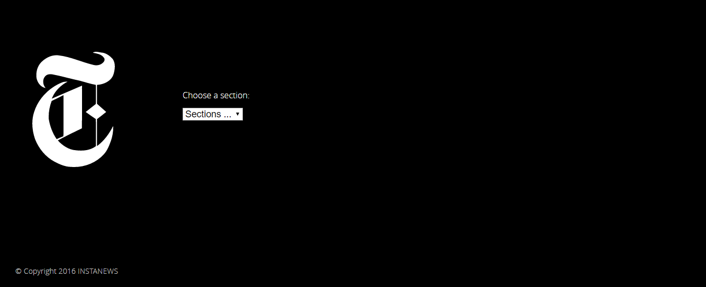
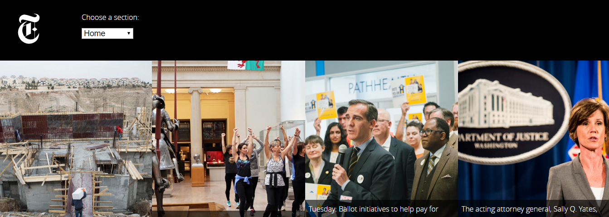

# Project 2: Instanews App

Main screen (Desktop)

Selected topic (Desktop)

* Create a one-page, responsive website that allows a user to filter top news story categories via the New York Times API.
* Optimize for 3 widths: mobile, min-width: 600px, and min-width: 1000px.
* Use Sass as a preprocessor

# Technologies Used
* Atom (http://atom.io)
* Git Bash (https://git-for-windows.github.io/)
* Google Chrome (https://www.google.com/chrome/)
* Google Chrome Developer Tools
* Fontface Ninja (Google Chrome extension)
* Page Ruler (Google Chrome extension)
* Eye Dropper (Google Chrome extension)
* HTML Validator (https://validator.w3.org/nu/#file)
* CSS Validator (https://jigsaw.w3.org/css-validator/#validate_by_upload)
* Gulp (autoprefixer, cssnano, eslint, notify, plumber, rename, sass, uglify)
* Font Squirrel (https://www.fontsquirrel.com/)
* Ajax
* JavaScript
* JQuery (https://jquery.com/)
* JQuery Plugins (Selectric: http://selectric.js.org/)
* Sass

# Personal Learnings
* I am a visual learner and writing out the design of a site helps me.

* The value of plugins and tools can be very helpful in identifying underlying issues in code or assist in making a website consistent across many browsers. The use of GULP makes a huge difference in how I work.

* My understanding of areas such as flexbox and JQuery are improving as I practice and test more often.

* Using SASS is a marked improvement from using vanilla CSS. By modularizing my css, it has improved my organization and allows me to review my code easier.
